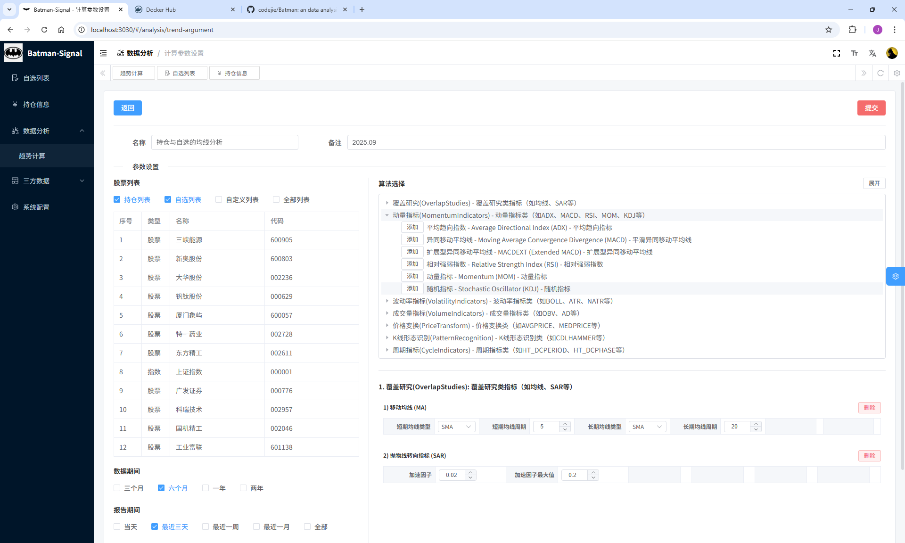

# Batman
an data analysis tool.
# Startup
1. 下载脚本
```shell
  curl -o docker-compose-services.yml https://raw.githubusercontent.com/codejie/Batman/master/deploy/docker-compose-services.yml
```
2. 启动应用
```shell
  docker compose -f docker-compose-services.yml up -d
```
3. 应用开启
    - <a href="http://localhost:3030" target="_blank">http://localhost:3000</a>

4. 应用初始
    - '系统配置' -> '数据更新': 股票列表信息/指数列表信息

# Screenshots
## 自选列表
<a href="./screenshots/customized.png" target="_blank"></a>  
## 持仓信息
### 持仓列表
<a href="./screenshots/holding.png" target="_blank"></a>  
### 持仓详情
<a href="./screenshots/holding-detail.png" target="_blank"></a>  
## 数据分析
### 趋势计算
<a href="./screenshots/trend-1.png" target="_blank"></a>
### 参数设置
<a href="./screenshots/trend-2.png" target="_blank"></a>
### 结果查看
<a href="./screenshots/trend-3.png" target="_blank"></a>
### 图表展示
<a href="./screenshots/trend-4.png" target="_blank"></a>
### 结果回测
<a href="./screenshots/trend-5.png" target="_blank"></a>
## 三方数据
### 技术数据
<a href="./screenshots/third-1.png" target="_blank"></a>
### 资讯链接
<a href="./screenshots/third-2.png" target="_blank"></a>
### 大盘云图
<a href="./screenshots/third-3.png" target="_blank"></a>

